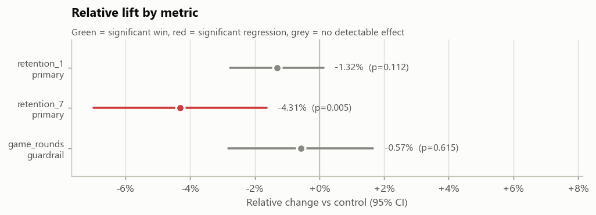
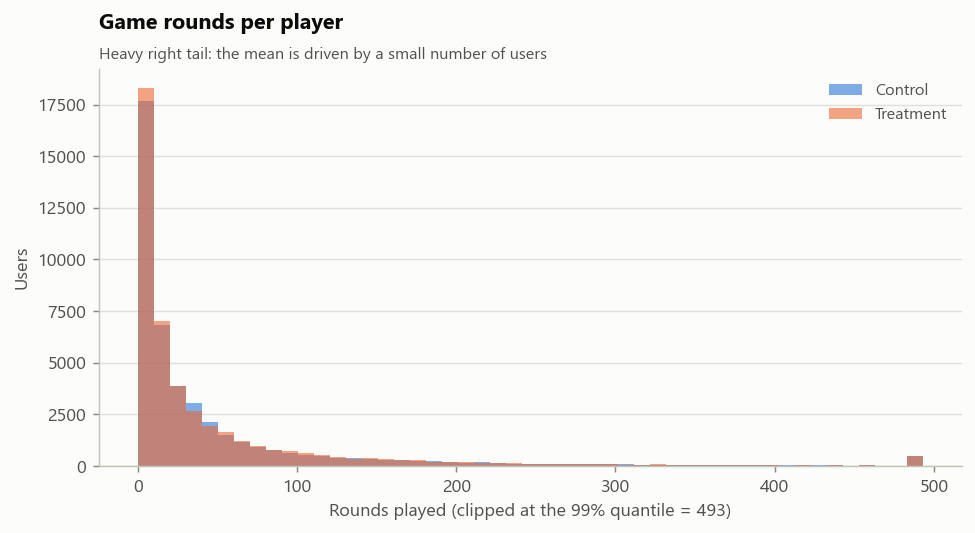
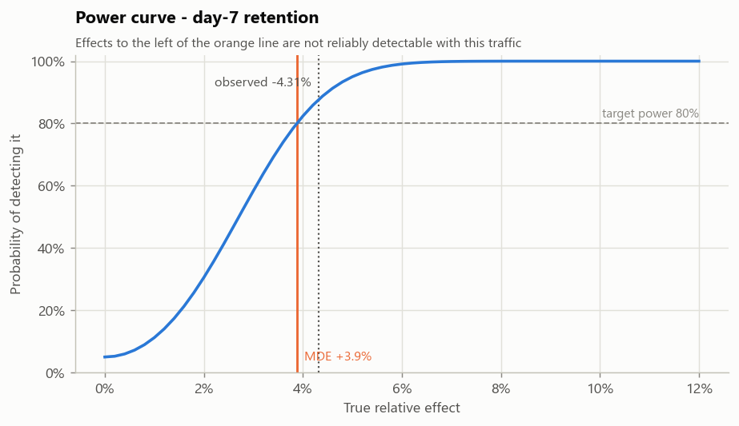
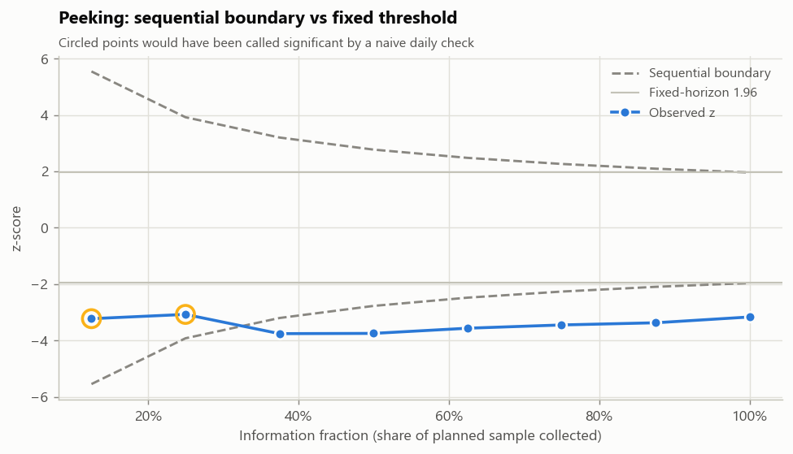

# A/B Testing: a toolkit and a worked experiment

A small, opinionated Python toolkit for analysing controlled experiments, plus a
complete analysis of a real one - the [Cookie Cats](https://www.kaggle.com/datasets/yufengsui/mobile-games-ab-testing)
mobile-game gate placement test, 90,189 players.

The toolkit encodes the parts of experiment analysis that are easy to get wrong:
Welch's t-test with the right degrees of freedom, sample-ratio checks before any
result is read, multiple-testing correction across the metric family, honest
power analysis, and alpha spending for mid-flight peeking. The analysis shows
what those tools say about a real decision.

```bash
pip install -e .
python analysis/fetch_data.py           # 1.5 MB public dataset
python analysis/run_cookie_cats.py      # analysis + report + figures
```

Output: [`reports/cookie_cats_report.html`](reports/cookie_cats_report.html) -
a standalone report with figures embedded.

---

## The finding

**Recommendation: do not ship gate 40.**

Moving the first progression gate from level 30 to level 40 was supposed to let
players go deeper before being blocked, and so improve retention. It did the
opposite where it counts.

| Metric | Role | Gate 30 | Gate 40 | Lift | 95% CI | p (BH-adj.) | Verdict |
|---|---|---:|---:|---:|---:|---:|---|
| Day-1 retention | primary | 44.82% | 44.23% | −1.32% | −2.77% to +0.13% | 0.112 | no effect |
| Day-7 retention | primary | 19.02% | 18.20% | **−4.31%** | −6.98% to −1.64% | **0.0047** | **regression** |
| Game rounds (99th pct. cap) | guardrail | 49.14 | 48.85 | −0.57% | −2.81% to +1.66% | 0.615 | no effect |

Day-7 retention falls by 0.82 percentage points. The confidence interval sits
entirely below zero, the Bayesian posterior puts the probability that gate 40 is
better at **0.1%**, and a 10,000-draw permutation test on the engagement metric
agrees with the parametric one (p = 0.607 vs 0.615). Every route to the answer
gives the same answer.



### Three things the analysis turns up that a naive read would miss

**1. The engagement metric is one player wide.** Raw mean rounds played differ by
−2.21% between arms. Remove the single most extreme player - one account with
49,854 rounds, against a median of 16 - and the difference collapses to −0.08%.
That is why the guardrail is winsorized at the 99th percentile (a shared cap
computed on pooled data, applied to both arms) before it is tested. Capping keeps
every randomised unit in its arm; dropping outliers would not.



**2. Ninety thousand users is not "enough data" in the abstract.** At this
sample size the experiment could reliably detect a 3.9% relative change in day-7
retention at 80% power. The observed −4.3% only just clears that bar. Detecting
a 2% change - a perfectly plausible size for a gate tweak - would have needed
about **337,000 players, 3.7× this experiment**. The day-1 result is not
evidence of no effect; it is an experiment that could not have seen a small one.



**3. Checking daily would have "found" the answer far too early.** Replaying the
experiment in a random arrival order and testing at eight points, a fixed
p < 0.05 threshold fires at all 8 looks - including at 12% of traffic, where the
O'Brien-Fleming boundary still demands z > 5.5. The direction happened to be
right here; the method that produced it is not one that can be trusted to be.



### Calls the analysis makes explicitly

- **The split is uneven, but not broken.** 44,700 / 45,489 is a 49.56/50.44
  split - chi-square p = 0.0086. That would fail a naive 0.05 threshold. The SRM
  check uses 0.001 deliberately: it runs on every experiment, and at that
  threshold this imbalance is within what randomisation produces. It is
  reported, not buried.
- **No segment breakdown.** The dataset has no pre-assignment attributes. The
  only other column, rounds played, is measured after assignment and is affected
  by the treatment - splitting on it would compare groups the treatment helped
  define. The toolkit supports segmentation with correction across slices; this
  experiment has nothing legitimate to segment on.
- **Two primary metrics, so p-values are corrected.** Benjamini-Hochberg across
  the family of three. Day-7 survives correction; nothing else was close.

---

## The toolkit

```python
from abtest import ExperimentConfig, ExperimentData, Experiment

config  = ExperimentConfig.from_yaml("experiments/cookie_cats.yml")
data    = ExperimentData.from_file("data/raw/cookie_cats.csv", config)
results = Experiment(data, config).run(resample=True)

results.summary()        # one row per metric
results.checks_frame()   # SRM, sparsity, outlier influence, data quality
results.decision()       # ship / do not ship, with the reasoning
```

Command line:

```bash
abtest analyze --config experiments/cookie_cats.yml --data data/raw/cookie_cats.csv \
               --html reports/out.html --segment-by country device
abtest checks  --config ... --data ...          # trust checks only, exit 1 on failure
abtest power   --baseline 0.19 --mde 0.02       # traffic needed before you start
```

### What is in it

| Module | Contents |
|---|---|
| `abtest/config.py` | Declarative experiment definition (YAML or code): metrics, roles, direction, alpha, power, correction method |
| `abtest/data.py` | Unit-level data contract: required columns, one row per unit, binary metrics really binary; fatal problems raise, the rest are reported |
| `abtest/checks.py` | Sample-ratio mismatch, normal-approximation sparsity, outlier influence, segment balance |
| `abtest/stats/frequentist.py` | Two-proportion z-test, Welch's t-test, CIs, observed power, MDE |
| `abtest/stats/power.py` | Sample size, MDE for a given sample, power curves, for proportions and means |
| `abtest/stats/bootstrap.py` | Percentile bootstrap CIs and permutation tests, batched and vectorised |
| `abtest/stats/bayesian.py` | Beta-Binomial posterior: P(B > A), expected loss, credible interval on lift |
| `abtest/stats/sequential.py` | O'Brien-Fleming boundaries and alpha spending for interim looks |
| `abtest/stats/variance.py` | CUPED variance reduction, winsorization with a shared cap |
| `abtest/stats/multiple.py` | Bonferroni and Benjamini-Hochberg |
| `abtest/experiment.py` | Orchestration: validate → check → test → correct → decide |
| `abtest/plots.py`, `report.py` | Figures and a self-contained HTML/Markdown report |

### Design decisions worth knowing

- **Welch by default, never Student.** A treatment can change a metric's
  variance as well as its mean. The degrees-of-freedom calculation pairs each
  variance with the sample size it came from - a detail that silently corrupts
  p-values when the arms are unequal, and which the test suite pins directly.
- **Two-sided, always.** A one-sided test cannot see a regression, and a
  regression is the thing most worth seeing.
- **Trust checks gate the result, not decorate it.** A failed SRM makes
  `decision()` return "do not use this result" regardless of how good the
  p-values look. The CLI exits non-zero.
- **Correction is on by default.** Testing three metrics at α = 0.05 gives about
  a 14% chance of at least one false positive. Metrics are only called moved
  after adjustment.
- **Verdicts respect metric direction.** A guardrail moving the wrong way is a
  regression, not a win, whatever the sign of the difference.
- **Every result is seeded and reproducible.** Same config plus same data gives
  the same numbers, including the resampling ones.

---

## Testing

```bash
pytest          # 84 tests
```

The statistical core is verified against `scipy` and closed-form identities
rather than recorded output: Welch against `scipy.stats.ttest_ind(equal_var=False)`
to 1e-12, sample size against the textbook formula, power and MDE as inverses of
each other, O'Brien-Fleming boundaries against their known values (3.92 / 2.77 /
2.26 / 1.96 at four looks), bootstrap intervals against the parametric interval
on normal data, CUPED for unbiasedness plus variance reduction across 20
simulated experiments. The pipeline tests build synthetic experiments with a
known effect and assert the toolkit reaches the right decision - including that
a broken split blocks the result entirely.

## Project structure

```
abtest/              the toolkit
  stats/             frequentist, bootstrap, power, bayesian, sequential, variance, multiple
analysis/            fetch_data.py, run_cookie_cats.py (the showcase)
experiments/         cookie_cats.yml - the experiment definition
tests/               84 tests
reports/             generated HTML/Markdown/JSON report and figures
docs/                background articles on experimentation practice
legacy/              the original educational codebase, archived
```

## Data

Cookie Cats A/B test, 90,189 players, published by Tactile Entertainment and
widely used for teaching. `analysis/fetch_data.py` downloads it; it is not
committed. One row per player: variant (`gate_30` / `gate_40`), rounds played in
the first week, and day-1 / day-7 retention flags.

## Notes on this repository

`docs/` holds background articles from the original educational project this
repository grew out of; they remain a useful companion on experimentation
practice. `legacy/` holds that original codebase, archived unchanged. Neither is
imported by the toolkit.

MIT licensed.
